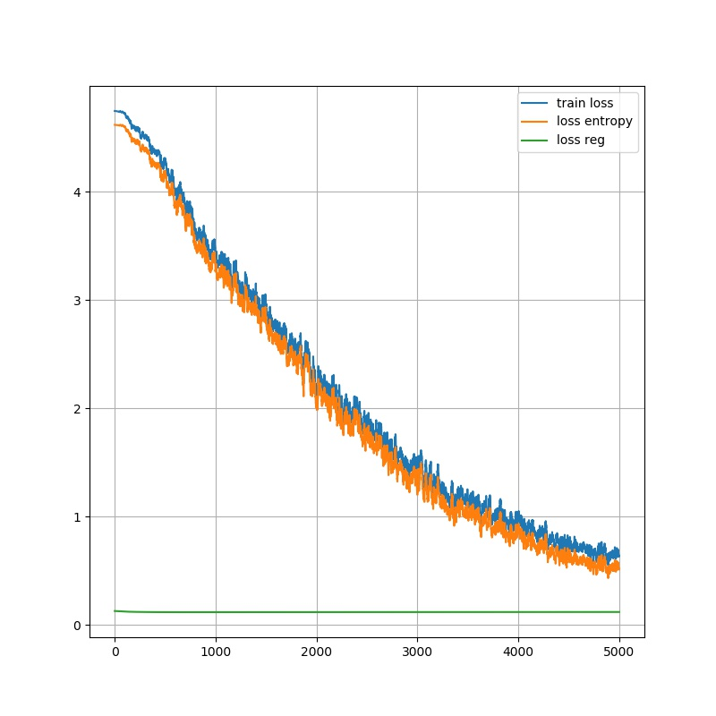
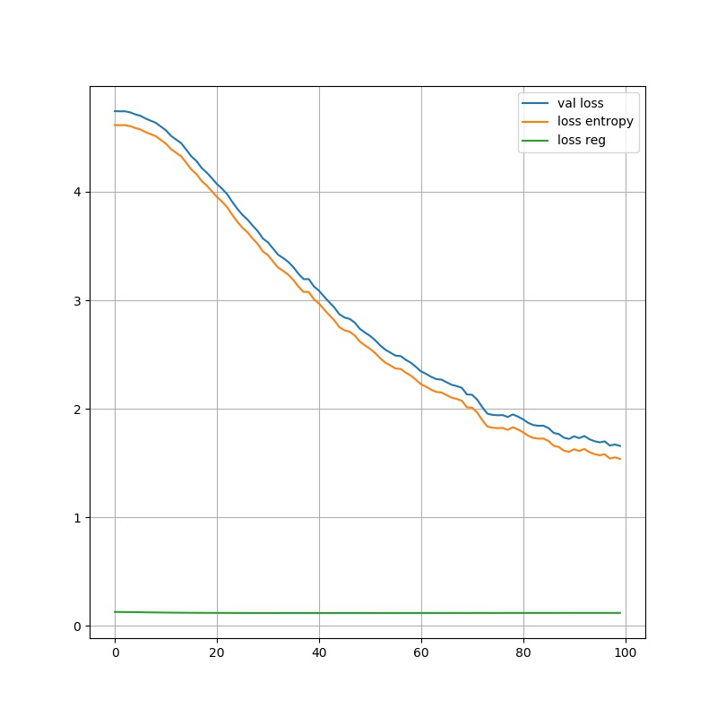
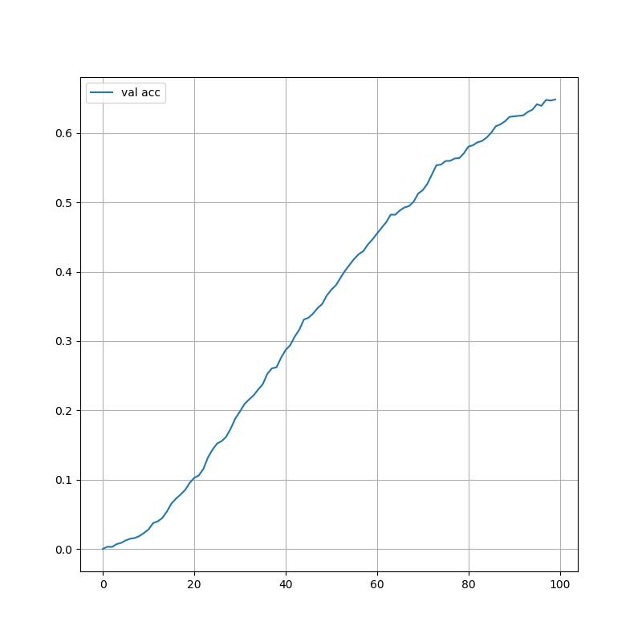

# C3D-tensorflow-eager

This is a repository trying to implement [C3D-caffe][4] on tensorflow eager execution.
The code is inspired by [C3D-tensorflow][5].    
The original paper is "Learning Spatiotemporal Features with 3D Convolutional Networks" [ICCV 2015][6]

## Requirements:

1. Install the tensorflow 1.14 or 2.0 versions (with eager execution), [Pillow][2]
2. Download the [UCF101][3] (Action Recognition Data Set) and extract it.
4. Run `list/convert_video_to_images.sh` to decode each avi file with 5FPS.
    - run `./list/convert_video_to_images.sh /the/path/to/UCF-101 5`
5. Split the data and generate {train,test}.list files in `list` directory.
    - `cd /list`
    - run `python convert_images_to_list.py --ucf_dir /the/path/to/UCF-101`, this will generate `test.list` and `train.list` files. The ratio of training samples to testing samples is `4:1`.

## Files
1. The model structure is defined in `C3D_model.py`.
2. The `crop_mean.npy` is used to pre-process the UCF image.
3. The hyper-parameters are saved in `params.py`. The `batch_size` is depend on the GPU memory, we use RTX 2080Ti with 11G.

## Train
1. `python train.py` will train C3D model for `5000` steps. The trained model will saved in `log/models` directory, and  training log will saved in `log/acc_log.npy`, `loss_train_log.npy`, and `loss_val_loss.npy`.
2. `python plot_res.py` will save the figure of training result in `log/pic` according to training log file. 

[1]: https://www.tensorflow.org/
[2]: http://pillow.readthedocs.io/en/3.1.x/reference/Image.html
[3]: http://crcv.ucf.edu/data/UCF101.php
[4]: https://github.com/facebook/C3D
[5]: https://github.com/hx173149/C3D-tensorflow
[6]: https://www.cv-foundation.org/openaccess/content_iccv_2015/html/Tran_Learning_Spatiotemporal_Features_ICCV_2015_paper.html